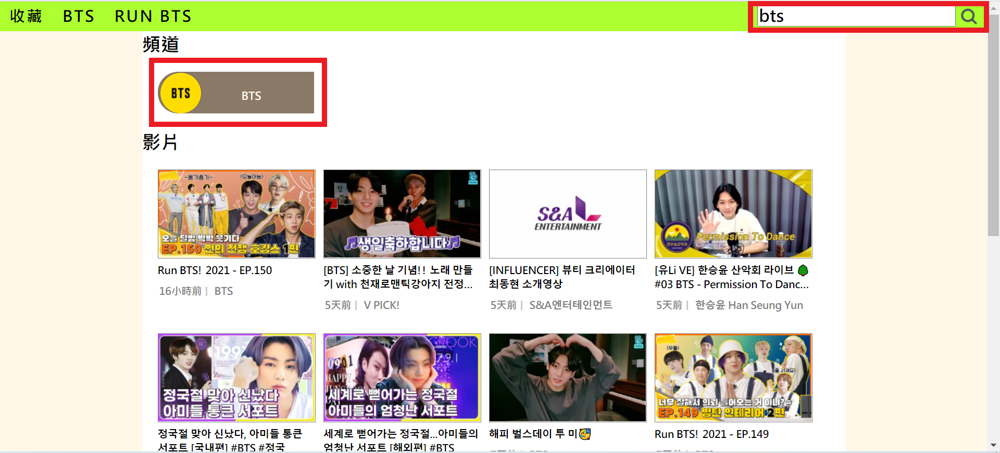
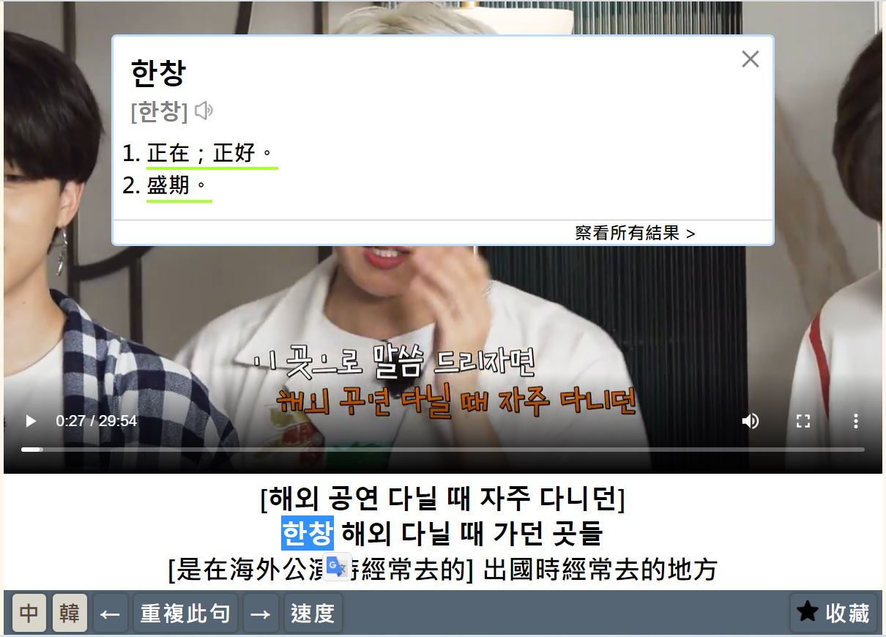
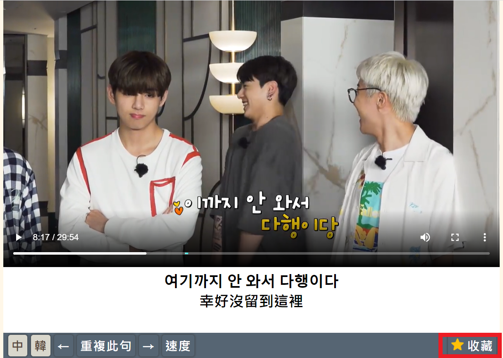
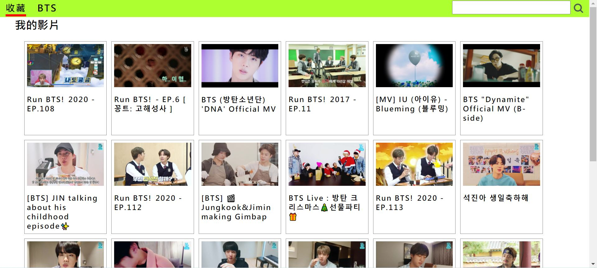
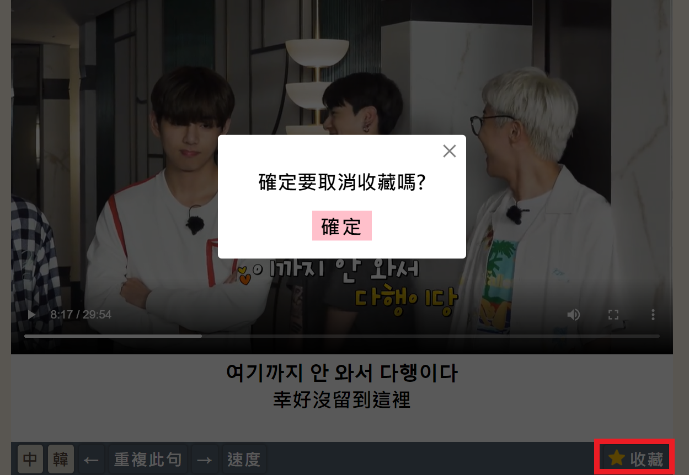
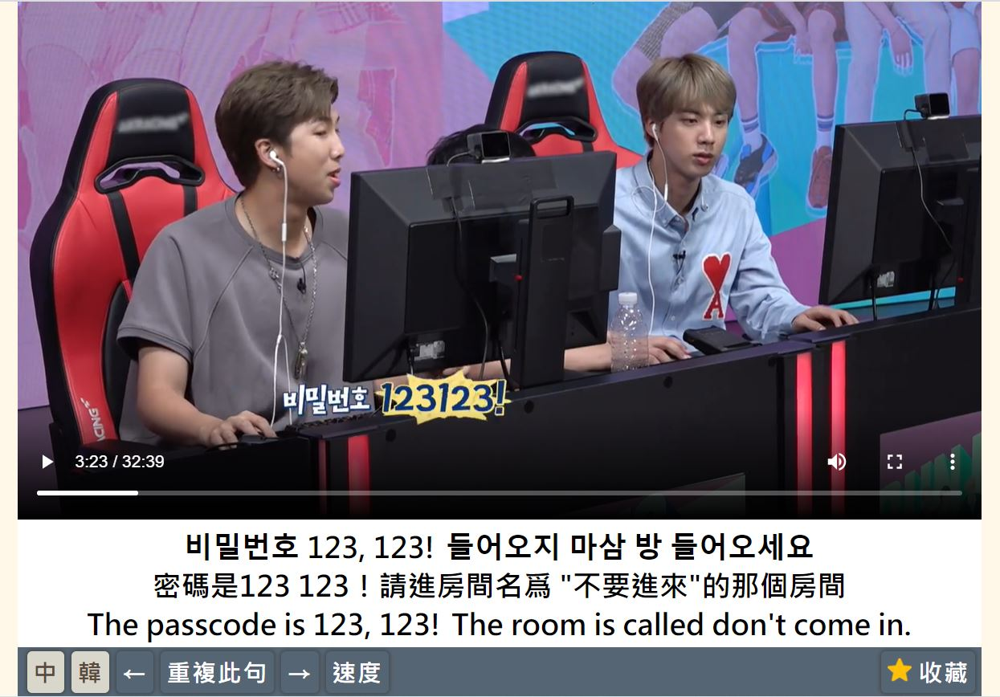
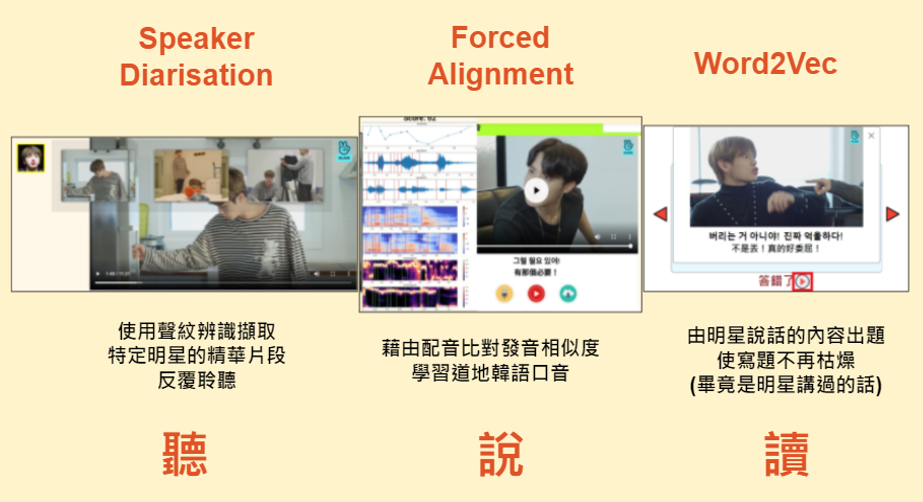

# KoreanLearing-mini
作品架在 https://flask-koreanlerning.herokuapp.com  
因為是免費資源，所以剛開始連會花一點時間重啟(約10秒)  
Because it is a free resource, it will take about 10 seconds to init at the beginning    

## 此作品是基於我個人興趣做的，所有版權皆不屬於我，請勿拿來用作商業用途

## 使用到的技術
此作品中運用到了前端、後端、資料庫、UI設計、系統架構設計、api設計、爬蟲、封包分析

前端: html、css、js  
後端: flask  
資料庫: sqlite  

## 作品介紹
### 此系統串接韓國直播平台vlive，可自由搜尋自己喜歡的團體  

### 影片字幕從vlive爬取，可藉由即時查詞邊看影片邊學單字  
### 單字來源: naver字典  
### 查詞功能是經由滑鼠選取觸發，手機無法使用  

### 如果喜歡可點選收藏

### 存入收藏頁面

### 再按一次即可取消收藏  

## 快捷鍵功能  
<kbd>🡨</kbd>、<kbd>🡪</kbd> 上一句、下一句  
<kbd>🡩</kbd>、<kbd>🡫</kbd> 調整音量  
<kbd>space</kbd> 暫停/播放影片  
<kbd>Z</kbd> 中文字幕   
<kbd>K</kbd> 韓文字幕  
<kbd>E</kbd> 英文字幕  
<kbd>R</kbd> 重複此句

### 按<kbd>E</kbd>可顯示英文字幕，藉由字幕學習英語 

## 全國大專校院資訊應用服務創新競賽第一名
### 之後為了比賽結合機器學習新增了一些功能

介紹影片: https://www.youtube.com/watch?v=Lz1-BlqCmuk  

為了使用免費版的heroku(容量考量)且方便管理，目前架在上面的是無AI版本

